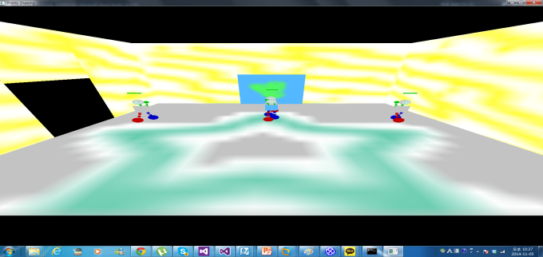
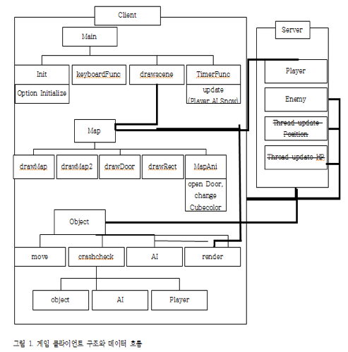
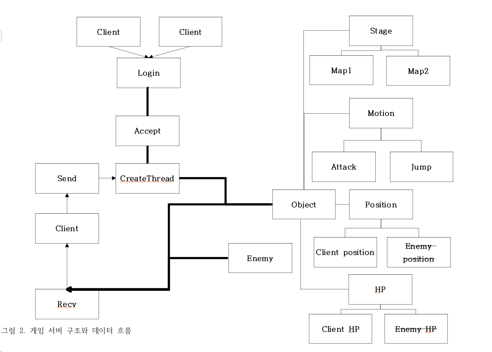

# TCP-IP-BattleField

> TCP/IP 소켓 통신을 이용해 실시간 대전 격투 기반의 게임을 네트워크 기능을 추가 시킨 프로젝트입니다

[](license.txt)

TCP/IP 소켓 통신을 이용해 실시간 대전 격투 기반의 게임을 네트워크 기능을 추가 시킨 프로젝트입니다



## 프로젝트 설명

실시간 대전 격투 기반의 게임을 네트워크 기능을 추가 시킨 프로젝트입니다.<br>
제일 먼저 low-level 디자인과 high-level 디자인을 문서화 해놓고 시작했습니다. 기존의 게임의 클래스와 아키텍쳐를 이해하고 클라이언트와 서버의 high-level 디자인을 했습니다. <br>
기획은 멀티 쓰레드로 포지션, 스테이지, 모션, HP 별로 할당해 독립적으로 동기화를 진행하려 했지만 그렇게 되면 컴퓨터 자원낭비가 심해 적 정보를 묶은 하나의 쓰레드와 플레이어 정보 쓰레드를 만들어 통신하게 했습니다.<br>
위 그림에서 설명한 방식처럼 각 클라이언트는 서버에 접속해서 TCP프로토콜로 멀티쓰레드를 이용해 다중 접속을 합니다. 그리고 쓰레드는 접속한 클라이언트의 정보를 받고 나머지 클라이언트에 대한 정보를 보냅니다.<br> 쓰레드는 업데이트 된 정보를 정해진 주기에 따라 나머지 클라이언트에게 보내줌으로써 동기화를 합니다.

## 게임 설명

- 게임 장르 : 액션 게임.

- 게임 방식 : 플레이 그라운드 위에서 사용자의 캐릭터가 차례로 나오는 NPC를 처치하는 게임. 

- 게임 목표 : 게임 내에 있는 NPC를 모두 다 처치하는 것.

- 게임 구성 : 사용자 캐릭터 , NPC , 플레이 그라운드, 아이템 , 하늘 ,건물 ,문, 원형 경기장(문을 열고 들어가면 있음)

- 게임 기능 :  상,하,좌,우 이동, 점프 ,주먹 공격 ,발차기 공격, 아이템 공격(종류 미정), 아이템 먹고 커지기 ,아이템 먹고 체력회복하기 ,건물 안으로 들어가기

## 구현 내용

1. 각 클라이언트에서 2명까지 클라이언트 접속가능(TCP)
2. 캐릭터 위에 HP 및 ID표시 Player Number표시(TCP)
3. 동시 타격 가능(TCP)
4. 각 클라이언트의 MAP전환 및 공유
5. 서버에서 각 클라이언트의 x ,y 위치 관리(TCP)
6. 업데이트 된 정보를 TCP 프로토콜으로 각 클라이언트에 실시간으로 전송(TCP).

## 게임 클라이언트/서버 구조와 데이터 흐름




## 실행 방법


1. [git clone](https://github.com/jangseongwoo/TCP-IP-BattleField.git) 을 하세요.
```sh
git clone https://github.com/jangseongwoo/TCP-IP-BattleField.git
```

2. 프로젝트 폴더 내  TCP-IP-BattleField/battleField/서버/서버.exe 를 실행시켜주세요.

3. 프로젝트 폴더 내 TCP-IP-BattleField/battleField/클라/클라.exe 를 실행시켜주세요.

## 개발 환경

- 사용 OS : 윈도우7 64bit
- 개발 툴 : Visual Studio 2013 , OpenGL, Window API 라이브러리 사용.

## 정보

프로젝트에 대한 더 자세한 정보를 원하신다면,  battleField 폴더 내에 있는 프로젝트 최종 보고서.hwp를 참조해주세요.

장성우 – [@facebook](https://www.facebook.com/profile.php?id=100007028118707&ref=bookmarks) – seongwoo.dev@gmail.com

MIT 라이센스를 준수하며 ``LICENSE``에서 자세한 정보를 확인할 수 있습니다.

[https://github.com/jangseongwoo/github-link](https://github.com/jangseongwoo/github-link)

<!-- Markdown link & img dfn's -->
[npm-image]: https://img.shields.io/npm/v/datadog-metrics.svg?style=flat-square
[npm-url]: https://npmjs.org/package/datadog-metrics
[npm-downloads]: https://img.shields.io/npm/dm/datadog-metrics.svg?style=flat-square
[travis-image]: https://img.shields.io/travis/dbader/node-datadog-metrics/master.svg?style=flat-square
[travis-url]: https://travis-ci.org/dbader/node-datadog-metrics
[wiki]: https://github.com/yourname/yourproject/wiki
